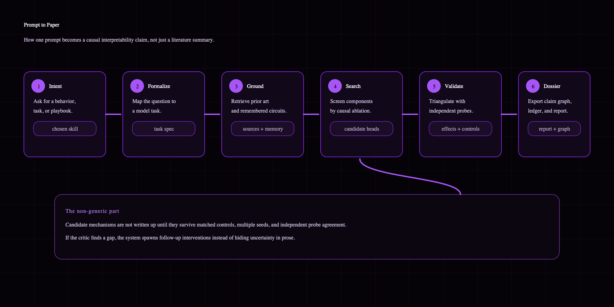
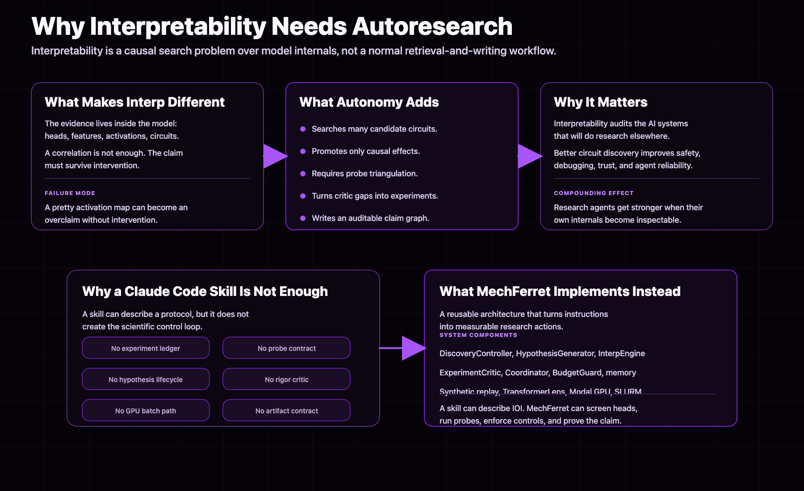
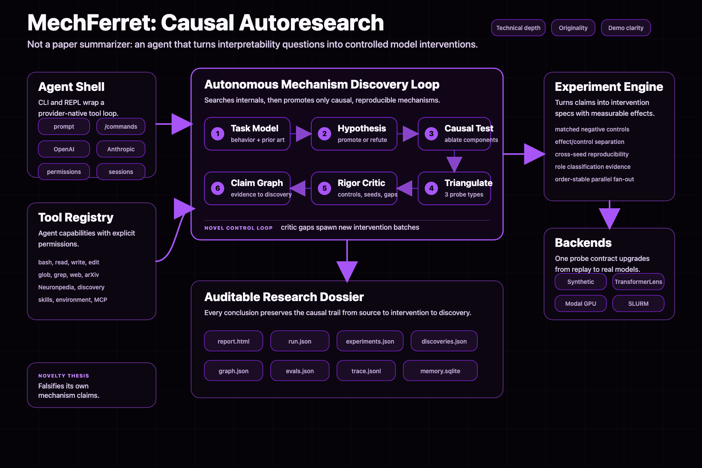
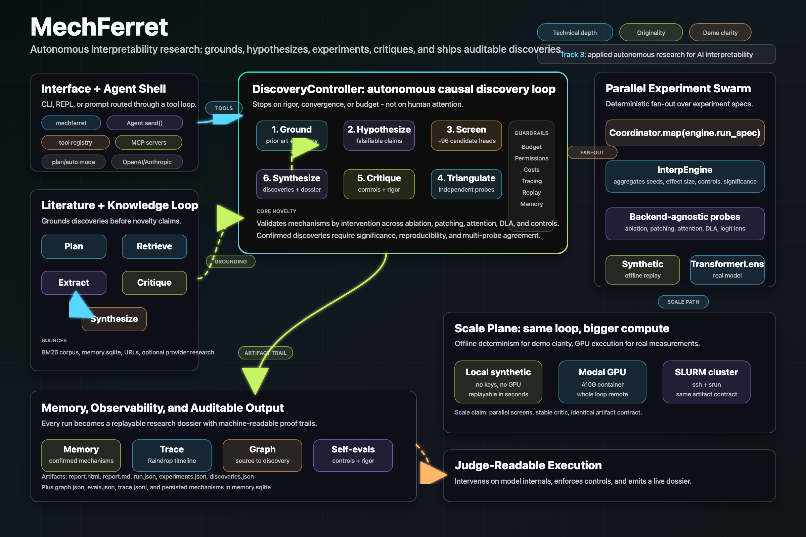

# MechFerret

**MechFerret is a prompt-to-paper autoresearch pipeline for interpretability.**

The goal is not "ask an AI to explain a model once." The goal is much bigger:
help more people, especially beginners, turn an interpretability idea into a
real research project and eventually a paper.

You start with a prompt like:

```text
I want to do an interpretability project on induction heads.
```

MechFerret helps turn that into:

- a research direction
- prior work and citations
- concrete hypotheses
- experiments to run
- evidence tracking
- follow-up gaps
- a paper outline or LaTeX draft
- a reviewer-style critique
- a trace of what happened along the way

In other words: **prompt -> research plan -> experiments -> evidence -> paper**.

That is the product. MechFerret is meant to make interpretability research feel
less like "you need to already be an expert with a giant notebook stack" and
more like "you can start with an idea and get pulled into a real research
workflow."

## Quickstart

From a checkout, use `python3 -m mechferret`. After `pipx install .`, replace
that prefix with `mechferret`.

Copy this path first. It stays offline, writes a local dossier, and gives you a
shareable health report if anything fails:

```bash
python3 -m mechferret init
python3 -m mechferret quickstart --run
python3 -m mechferret status
python3 -m mechferret support
```

In a checkout, `make quickstart` is a shortcut for creating the local demo
dossier.

Then inspect or package the result:

```bash
python3 -m mechferret open quickstart
python3 -m mechferret open report --select best --browser
python3 -m mechferret audit runs/demo/run.json --strict
python3 -m mechferret verify runs/demo/run.json --strict
```

The executable demo quickstart writes a durable artifact index at
`runs/demo/QUICKSTART.md` plus `runs/demo/quickstart.json`.
The executable CI quickstart runs the offline release gates and writes
`runs/demo/CI_QUICKSTART.md` plus `runs/demo/ci_quickstart.json`.
`mechferret init` writes `MECHFERRET.md`, the project-notes file that the
interactive agent reads into its system prompt.
For the full generated command reference, see [docs/CLI.md](docs/CLI.md);
for a runnable cheat sheet, see [docs/CLI_EXAMPLES.md](docs/CLI_EXAMPLES.md).

Useful next commands:

```bash
python3 -m mechferret next
python3 -m mechferret commands --group start
python3 -m mechferret commands --workflow
python3 -m mechferret commands --workflow publish_dossier
python3 -m mechferret selftest --run --out runs/selftest
python3 -m mechferret run "What should I investigate?" --seed-corpus --out runs/custom
python3 -m mechferret paper --select best --provider local --json
python3 -m mechferret bundle --select best
python3 -m mechferret verify-bundle --select best --strict
```

For an OpenVLA sparse-autoencoder project:

```bash
python3 -m mechferret quickstart --mode openvla --run
python3 -m mechferret sae openvla init
python3 -m mechferret sae openvla status
python3 -m mechferret sae openvla status --json
python3 -m mechferret sae openvla commands
```

The OpenVLA quickstart writes `projects/openvla_sae/QUICKSTART.md` with the
next manifest/cache/train commands. When the tracked scaffold already exists,
`mechferret open openvla` resolves `projects/openvla_sae/README.md` directly.

For arbitrary `mechferret run` questions, pass `--source`, `--url`, memory from
a prior run, or a configured live provider. The packaged seed corpus is only
used when you explicitly request `--seed-corpus` or run the demo/quickstart path.
Discovery can run experiment-only without prior-art documents; add `--source`
or `--url` for literature grounding, or pass `--seed-corpus` to explicitly use
the packaged demo notes as prior art.
Local runs use extractive, evidence-ledger synthesis and label it as such in the
report. Pass `--provider openai` or `--provider anthropic` when you want
model-authored final prose from the recorded claims, evidence, gaps, and
experiments.



## Why Interpretability?

Interpretability is one of the best possible domains for an autoresearch agent.

AI is becoming more important every year, but we still do not understand these
models nearly well enough. Interpretability is the field trying to change that.
It studies what models learn, how internal features work, what circuits appear,
why behaviors emerge, and how we can make AI systems easier to understand and
debug.

That matters for humanity.

Better interpretability means:

- safer AI systems
- more understandable failures
- better debugging tools
- better tools for studying model internals
- stronger scientific foundations for AI
- more people able to contribute to AI safety and model understanding

This is why we picked interpretability as the applied domain. If autoresearch
can speed up interpretability, it does not just help one field publish more
papers. It helps the field that tries to understand the systems everyone else
will build on top of.

There is also a huge access problem. Interpretability is exciting, but it is
hard to enter. A beginner has to figure out the literature, pick a problem, set
up experiments, understand what counts as evidence, avoid overclaiming, and
write the work up in a way that looks like a real ML paper.

MechFerret is built for that gap.

It is not replacing researchers. It is giving new researchers a guided path
from "I have an idea" to "I have a structured project with evidence, gaps, and a
paper draft."



## What MechFerret Actually Is

MechFerret is an interpretability research operating system. The interface feels
like a coding-agent prompt, but the project is organized around research
objects: sources, claims, hypotheses, experiment specs, results, mechanisms,
gaps, traces, and paper drafts.

It has a conversational interface, but the useful part is the pipeline behind
it:

```text
prompt
  -> understand the research goal
  -> search and summarize prior work
  -> suggest concrete interp directions
  -> turn a direction into hypotheses
  -> run or script experiments
  -> track evidence and mechanisms
  -> show the evidence architecture
  -> draft a paper
  -> review the paper
  -> keep memory so the project can continue
```

The system is designed around the shape of an actual research project, not just
a one-off answer.

Under the hood, MechFerret keeps a few pieces separate:

- **Agent shell:** the CLI/REPL, provider chat, commands, sessions, and tool
  routing.
- **Literature loop:** retrieves prior work, extracts claims, tracks citations,
  and identifies gaps.
- **Discovery loop:** turns an interp direction into hypotheses and experiment
  specs.
- **Experiment engine:** runs or scripts probes, compares effects against
  controls, and records reproducibility.
- **Memory:** keeps confirmed findings and experiment records across sessions.
- **Paper layer:** turns accumulated findings into `runs/*/paper/main.tex` and lets a
  configured model reviewer critique the draft.
- **Observability:** emits a trace that can be inspected locally or streamed to
  Raindrop Workshop.



Some examples of what it can do from the prompt:

- run a local prompt-to-dossier path with `/demo`
- use the `run_research` agent tool for source-grounded literature or planning
  questions
- explain why interpretability is the domain with `/why`
- show how evidence supports claims with `/arch`
- generate run-bound `main.tex` with `/paper`
- ask a configured model reviewer to score the draft with `/review-paper`
- run discovery-style interpretability experiments with `/discover`
- remember confirmed findings and experiment results across sessions
- stream trace events to Raindrop Workshop
- dispatch heavier experiment work to Modal

The important shift is this: MechFerret is not just "an assistant that knows
about interpretability." It is a workflow for producing interpretability
research artifacts.

## The Evidence Contract

The reason this is more than a writing assistant is that every paper-shaped
claim is supposed to trace back to concrete research state.

For an interpretability project, MechFerret tries to keep track of:

- **Sources:** papers, notes, docs, web results, and remembered prior runs.
- **Claims:** compact statements extracted from sources or produced by the
  research loop.
- **Hypotheses:** testable ideas about a mechanism, feature, circuit, task, or
  experimental direction.
- **Experiment specs:** what to run, on what target, with what control, seeds,
  and budget.
- **Results:** effects, controls, significance, reproducibility, and failure
  notes.
- **Gaps:** what is still missing before a paper claim is strong.
- **Draft text:** the paper output generated from the current evidence, not
  from an empty prompt.

That contract is what makes the pipeline useful for beginners. It teaches the
shape of real research: do not just write the claim; connect it to evidence,
show what would falsify it, and be honest about what is still weak.

## Who This Is For

MechFerret is especially for people who want to do interpretability research but
do not yet know how to turn an idea into a paper.

That includes:

- beginners trying to enter mechanistic interpretability
- hackathon teams trying to build a serious research demo quickly
- researchers who want a faster way to scaffold projects
- people with an interp idea who need help turning it into experiments
- anyone who wants a traceable research pipeline instead of a one-off chat
  transcript

The dream version is simple: a motivated beginner can show up with curiosity,
use MechFerret to pick a tractable direction, run the loop, and end up with
something close to a publishable artifact.

Not a guaranteed accepted paper. But a real path toward one.

## The Hackathon Story

This is built for the Raindrop autoresearch hackathon, specifically **Track 3:
Applied Autonomous Research**.

Our applied domain is interpretability because interpretability is good for
humanity, hard to enter, and perfect for research automation.

The project we want to show is:

> An autoresearch agent that helps interpretability research itself.

That is different from a normal literature assistant. A literature assistant
can summarize papers. MechFerret tries to move the whole research process
forward: idea, plan, prior work, experiments, evidence, draft, review, iterate.

What judges should see:

- **Applied domain:** interpretability, because understanding AI systems is
  important and more people should be able to contribute.
- **Autonomous research loop:** the system does more than answer questions; it
  keeps state, runs tools, records evidence, and writes outputs.
- **Beginner leverage:** it helps someone go from prompt to paper-shaped
  research instead of staring at a blank repo.
- **Raindrop fit:** the agent's steps are visible as a trace, not hidden in a
  chat transcript.
- **Modal fit:** when research needs compute, experiments can move to a Modal
  GPU while the same project loop stays intact.



## Why Not Just A Claude Code Skill?

A Claude Code skill is useful for giving an assistant instructions. You can
write a skill that says:

```text
When doing interpretability research, read prior work, propose hypotheses,
write experiments, and draft a paper.
```

That is helpful, but it is not enough.

MechFerret is better because it turns the workflow into an actual system. The
research state lives outside the assistant's vibes. It has commands, memory,
traces, artifacts, experiment ledgers, and paper generation.

The difference is:

| Claude Code skill | MechFerret |
| --- | --- |
| Tells an assistant what to do. | Gives the researcher an end-to-end pipeline. |
| Lives mostly as instructions in context. | Stores project state, memory, traces, and artifacts. |
| Can suggest a paper structure. | Writes run-bound `paper/main.tex` from the run artifact and evidence ledger. |
| Can remind you to evaluate evidence. | Tracks experiments, mechanisms, claims, gaps, and drift. |
| Can say "run this on a GPU." | Has Modal dispatch for heavier runs. |
| Produces a chat unless you manually organize outputs. | Produces reports, JSON ledgers, traces, and paper files. |
| Helps an expert move faster. | Also helps a beginner know what the next research step is. |

The key point: a skill is a recipe. MechFerret is the kitchen.

For a beginner, that matters a lot. They do not just need a list of best
practices. They need a guided path, persistent project memory, commands that
produce real files, and a way to see whether their evidence is paper-worthy.

That is why MechFerret is more than a Claude Code skill. It is infrastructure
for making interpretability research easier to start, continue, audit, and
write up.

## How The Pipeline Feels

In the interactive prompt:

```bash
mechferret
```

You can do things like:

```text
/btw <prompt>   run a compact side question while another reply is running
/queue          show the active and queued prompts
/queue show <id>  show a queued job's full prompt, reply, or error
/queue retry <id> retry a job without retyping its prompt
/queue edit <id> <prompt> edit a queued prompt before it starts
/queue move <id> first|last|before|after reorder a queued prompt before it starts
/queue cancel <id|all> cancel queued prompts from the queue view
/queue clear queued|saved|all clear live or saved queue state
/queue pause   hold queued prompts after the active reply finishes
/queue resume  resume held queued prompts
/queue restore  restore saved queued/running prompts from the last session
/queue wait     wait until active queued and side work finishes
/queue join <id> wait for one queued or side job to finish
/cancel <id>    remove a queued prompt before it starts
/quickstart     show the recommended demo/OpenVLA/CI command path
/selftest       run offline readiness checks and optionally verify demo artifacts
/status         show setup, selected run, audit/verify state, artifacts, and next actions
/runs           list recent runs with audit and artifact status
/why            explain why interpretability is the right domain
/demo           run the local prompt-to-dossier demo
/arch           show how the evidence supports the claims
/audit          check whether the dossier is paper-ready
/verify         verify manifest hashes and artifact existence
/paper          generate main.tex from the selected run
/sae openvla    plan/cache/train workflow for OpenVLA sparse autoencoders
/review-paper   have a configured model critique the paper
/bundle         package a run dossier into a shareable zip
/verify-bundle  verify a shareable zip's manifest and run metadata
/trace          show recent trace events
/memory         show remembered findings
```

Outside the prompt, `mechferret open all` prints the latest artifact index.
`mechferret status` summarizes project notes, the selected run, audit and verify state,
memory counts, artifact availability, and the next concrete commands.
It reports run, share, and setup readiness separately so a packaged selected run
does not look blocked by optional setup artifacts.
`mechferret runs` lists recent run artifacts with audit pass/fail, readiness,
questions, and key artifact availability so stale runs are easy to spot.
Use `--select latest`, `--select best`, or `--select ready` on `runs`, `open`,
`paper`, `review-paper`, `audit`, `verify`, `resume`, `inspect`, `cost`,
`status`, `bundle`, and `verify-bundle` when a newer run is not the run you want
to act on.
`mechferret verify` checks `runs/*/manifest.json`, source digests, immutable
artifact hashes, and declared artifact paths before you share a dossier.
`mechferret bundle` writes a zip with the run ledger, reports, audit/status JSON,
paper/review files when present, project notes, and a manifest for sharing.
`mechferret verify-bundle` checks the archive entries, byte sizes, hashes, and
run identity metadata before you hand off that zip.
`mechferret tool-results` lists saved large agent-tool outputs, and
`mechferret tool-results --clean` previews cleanup before deleting anything.
`mechferret open quickstart`, `mechferret open ci`, `mechferret open report`,
`mechferret open graph`, `mechferret open evals`, `mechferret open trace`,
`mechferret open paper`, `mechferret open review`, `mechferret open bundle`,
`mechferret open pdf`, and `mechferret open openvla` resolve individual
artifacts. Add `--browser` to open browser-readable files from the command line.

Before a demo or release pass, run:

```bash
mechferret quickstart --mode ci --run
mechferret selftest --report runs/selftest/selftest.json
mechferret selftest --run --out runs/selftest
mechferret quickstart --mode ci
mechferret doctor
mechferret doctor --strict
mechferret doctor --all-integrations
mechferret audit --strict
mechferret verify --strict
mechferret verify-bundle --select best --strict
mechferret doctor --json
mechferret audit --json
```

Default doctor mode checks the offline core path and reports optional setup work
separately. Strict mode is a practical release gate for core checks.
`--all-integrations` is the exhaustive environment audit for optional SDKs,
API keys, cluster config, and project-specific manifests.

`audit --strict` is the CI-friendly paper-readiness gate: it exits nonzero when
the latest run, or a specific `run.json`, has failed evidence gates.
`verify --strict` is the corresponding artifact-integrity gate. Current-run
manifest failures also appear in `audit` and `status`, so a stale or tampered
report cannot look ready just because the evidence gates pass.
Audit also emits non-failing advisories for demo/local caveats, such as local
extractive synthesis, synthetic discovery backends, or packaged seed-corpus
usage. Those advisories stay in status output and bundles so a green local demo
is not confused with provider-authored prose or real-model experimental evidence.

The intended loop is:

1. Start with a research prompt.
2. Let the agent help shape it into a tractable interp project.
3. Use tools and experiments to collect evidence.
4. Use `/arch` to see whether the evidence actually supports the claim.
5. Use `/audit` to catch drift, weak evidence, and missing artifacts.
6. Use `/verify` before sharing so hashes and declared artifact paths line up.
7. Use `/paper` to turn the project into a draft.
8. Use `/review-paper` or `mechferret review-paper` to get a harsh review.
9. Use `/bundle` to package the evidence for sharing.
10. Iterate.

That is the prompt-to-paper story.

## Research Modes

MechFerret supports a few different levels of "realness" because a research
pipeline has to be useful before every GPU job or full experiment is ready.

| Mode | What it is for | Output |
| --- | --- | --- |
| Local demo | Runs a complete source-to-dossier path without API keys or GPUs. | Sources, claims, gaps, report, audit, paper scaffold. |
| Literature loop | Grounds a direction in sources and prior work. | Sources, claims, gaps, dossier. |
| Discovery loop | Runs structured interp experiments for skills like IOI. | Experiments, discoveries, graph, evals. |
| Paper loop | Converts current findings into a draft and review cycle. | `runs/*/paper/main.tex`, optional PDF, reviewer scores. |
| Modal path | Runs heavier experiment work on GPU infrastructure. | Same artifact contract, larger compute. |

The discovery loop refuses obvious prompt/task drift. For example, an OpenVLA
SAE prompt should not silently run a GPT-2 IOI circuit demo; MechFerret will ask
you to run `mechferret sae openvla plan`, use literature mode, add a matching
skill/backend, or explicitly pass `--allow-mismatch` for a deliberate demo run.

OpenVLA SAE project commands:

```bash
mechferret sae openvla status
mechferret sae openvla status --json
mechferret sae openvla init
mechferret sae openvla create-manifest --image-dir data/openvla_images --manifest data/openvla_sae_phase1.jsonl
mechferret sae openvla smoke --out runs/openvla_sae/smoke
mechferret sae openvla plan --out runs/openvla_sae/plan
mechferret sae openvla validate-manifest --manifest data/openvla_sae_phase1.jsonl --json
mechferret sae openvla eval --cache-dir runs/openvla_sae/cache_l24 --checkpoint runs/openvla_sae/sae_l24_topk.pt --out runs/openvla_sae/eval
mechferret sae openvla features --cache-dir runs/openvla_sae/cache_l24 --checkpoint runs/openvla_sae/sae_l24_topk.pt --out runs/openvla_sae/features
mechferret sae openvla dossier --cache-dir runs/openvla_sae/cache_l24 --checkpoint runs/openvla_sae/sae_l24_topk.pt --out runs/openvla_sae/dossier --json
mechferret sae openvla commands
```

`init` copies the packaged OpenVLA SAE workflow into `projects/openvla_sae`, so
the workflow works after `pipx install` as well as inside this repository.

For a short GPU sanity check, run the phase-1 script with overrides instead of
editing YAML:

```bash
CACHE_MAX_EXAMPLES=8 python projects/openvla_sae/src/cache_openvla_activations.py --manifest data/openvla_sae_phase1.jsonl --out-dir runs/openvla_sae/cache_l24 --site language_model.model.layers.24 --dry-run
SAE_STEPS=100 SAE_BATCH_SIZE=512 SAE_K=32 bash projects/openvla_sae/scripts/phase1_commands.sh
```

This matters because beginners need scaffolding at every stage. Early on, they
need help choosing a tractable direction. Later, they need experiment structure.
At the end, they need a paper narrative and a critical review. MechFerret tries
to keep those stages connected instead of treating them as separate tools.

## Modal

Some parts of interpretability research are light: reading papers, planning,
writing, reviewing, organizing evidence.

Some parts need real compute.

Modal is the compute path. When the project needs heavier model experiments,
MechFerret can dispatch work to a Modal GPU container instead of pretending
everything should run on a laptop.

The Modal integration lives in `mechferret/modal_app.py`.

Useful commands:

```bash
pip install -e '.[modal,interp]'
mechferret /modal status
mechferret /modal setup
mechferret /modal run --skill ioi-circuit
mechferret /modal status --json
```

The default GPU is `A10G`. You can change it with:

```bash
export MECHFERRET_MODAL_GPU=A100
```

For the hackathon, Modal shows that the pipeline is not only a local showcase.
It has a path to real compute when an interpretability project needs it.

## Raindrop Workshop

Raindrop is the visibility layer.

For autoresearch, the trace is part of the product. We do not just want a final
paper draft. We want to see what the agent did to get there: what it searched,
what tools it ran, what evidence it recorded, where it changed direction, and
what artifacts it wrote.

MechFerret writes trace events to:

```text
.mechferret/trace.jsonl
```

Discovery runs also write traces under their run directory, such as:

```text
runs/demo/trace.jsonl
```

To stream spans into Raindrop Workshop:

```bash
export RAINDROP_LOCAL_DEBUGGER=1
raindrop workshop
mechferret
```

By default, traces post to:

```text
http://127.0.0.1:5899/v1/traces
```

The local trace file is always written, even if Workshop is not running. So the
demo can be live and reviewable, but the pipeline does not depend on the
debugger being up.

## Interactive Prompt Demo

Install or use the checkout directly:

```bash
pipx install .
pipx ensurepath
```

Open the prompt after installing:

```bash
mechferret
```

Useful demo flow:

```text
/why
/demo
/arch
/audit
/paper
/review-paper
```

Run the local discovery check:

```bash
mechferret discover --skill ioi-circuit --out runs/demo
mechferret discover --skill ioi-circuit --out runs/demo --json
mechferret discover --skill ioi-circuit --seed-corpus --out runs/demo-with-prior
open runs/demo/report.html
```

Run on Modal:

```bash
mechferret /modal status
mechferret /modal run --skill ioi-circuit --out runs/modal-demo
mechferret /cluster status --json
mechferret /cluster run --skill ioi-circuit --dry-run --json
```

## What Gets Produced

Depending on the path you run, MechFerret can produce:

- `.mechferret/memory.sqlite` - project memory
- `runs/*/trace.jsonl` - inspectable trace spans
- `runs/*/paper/main.tex` - generated paper draft; with a configured model, prose is model-authored from evidence, while local mode renders an evidence-bound manuscript scaffold from the run ledger
- `runs/*/paper/main.pdf` - compiled paper, if `tectonic` is installed
- `runs/*/report.html` - readable research report
- `runs/*/report.md` - Markdown report
- `runs/*/run.json` - full structured run
- `runs/*/manifest.json` - source digests, provenance, and artifact hashes
- `runs/*/experiments.json` - experiment records
- `runs/*/discoveries.json` - confirmed findings
- `runs/*/graph.json` - evidence graph
- `runs/*/evals.json` - self-checks and rigor checks

The point of these files is to make the research legible. A beginner should be
able to see what happened, what is supported, what is weak, and what to do next.

## Skills

Skills are reusable research playbooks in `mechferret/skills/`.

They define things like:

- the task
- the model
- the experiment budget
- the evidence bar
- the stopping condition

List them:

```bash
mechferret /skills
```

Show one:

```bash
mechferret /skills ioi-circuit
```

Built-in skills:

- `ioi-circuit`
- `find-induction-heads`
- `logit-lens-sweep`
- `factual-recall-trace`

Skills are useful, but they are only one piece. The bigger value is that
MechFerret wraps skills in memory, tracing, reports, paper generation, review,
and compute dispatch.

## Local Setup

The core package has no required runtime dependencies and works offline on
Python 3.11+.

Install with `pipx`:

```bash
pipx install .
pipx ensurepath
```

For development:

```bash
pipx install --force --editable .
```

Or run without installing:

```bash
python3 -m mechferret
```

Optional extras:

```bash
pip install -e '.[modal,interp]'      # Modal + real model backend
pip install -e '.[openai]'            # OpenAI provider research
pip install -e '.[anthropic]'         # Anthropic provider research
pip install -e '.[all]'               # everything
```

## Development

Run tests:

```bash
python3 -m unittest discover -s tests
```

The GitHub Actions workflow runs the same offline core gates on Python 3.11 and
3.12: doctor, unit tests, bytecode compilation, audit JSON smoke tests, and the
executable CI quickstart. It also builds and installs the wheel in a fresh venv
outside the repository to verify packaged templates and console entry points.

Run the prompt:

```bash
python3 -m mechferret
```

More docs:

- [Contributing](CONTRIBUTING.md)
- [Code of conduct](CODE_OF_CONDUCT.md)
- [Support](SUPPORT.md)
- [Security policy](SECURITY.md)
- [Citation metadata](CITATION.cff)
- [Changelog](CHANGELOG.md)
- [CLI reference](docs/CLI.md)
- [CLI examples](docs/CLI_EXAMPLES.md)
- [Architecture](docs/ARCHITECTURE.md)
- [Demo script](docs/DEMO_SCRIPT.md)
- [REPL implementation](mechferret/repl.py) for `/why`, `/paper`, and `/review-paper`
- [Modal dispatch](mechferret/modal_app.py)
- [Raindrop tracing](mechferret/tracing.py)

## License

MechFerret is released under the [MIT License](LICENSE).

## Citation

If you use MechFerret in research or tooling, cite it using
[CITATION.cff](CITATION.cff).
